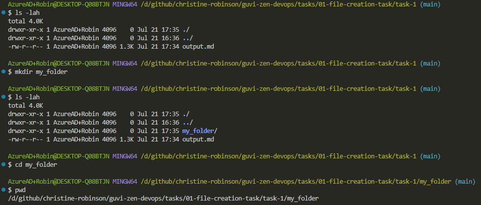
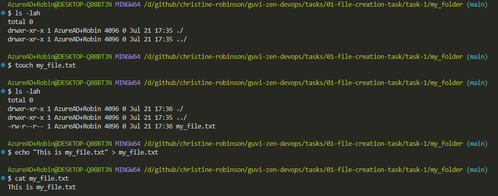
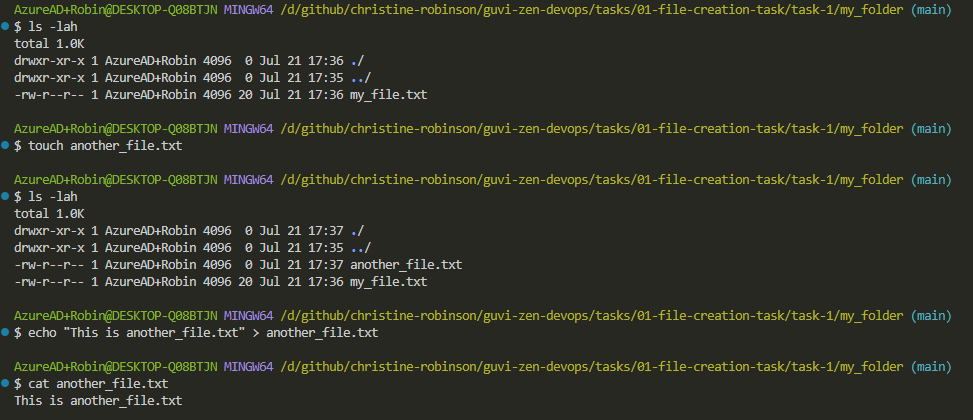
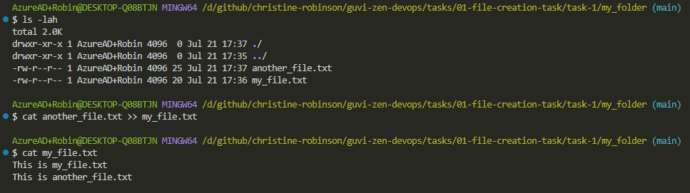
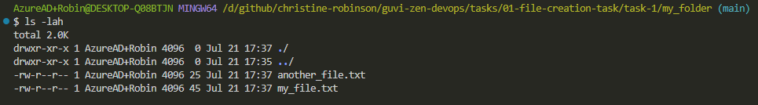

# File Creation Task

## Task 1

### Create "my_folder" directory &amp; navigate into it

```bash
# List files
ls -lah

# Create a directory
mkdir my_folder

# List files
ls -lah

# Navigate to my_folder
cd my_folder

# Show the present working directory
pwd
```



### Create "my_file.txt" with some text

```bash
# List files
ls -lah

# Create my_file.txt
touch my_file.txt

# List files
ls -lah

# Overwrite content to my_file.txt
echo "This is my_file.txt" > my_file.txt

# Print my_file.txt
cat my_file.txt
```



### Create "another_file.txt" with some text

```bash
# List files
ls -lah

# Create another_file.txt
touch another_file.txt

# List files
ls -lah

# Overwrite content to another_file.txt
echo "This is another_file.txt" > another_file.txt

# Print another_file.txt
cat another_file.txt
```



### Concatenate the content of "another_file.txt" to "my_file.txt" and display the updated content

```bash
# List files
ls -lah

# Concatenate my_file.txt
cat another_file.txt >> my_file.txt

# Print my_file.txt
cat my_file.txt
```



### Finally, list all files and directories in the current directory

```bash
# List files
ls -lah
```


