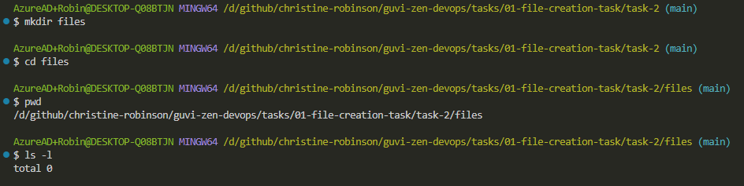
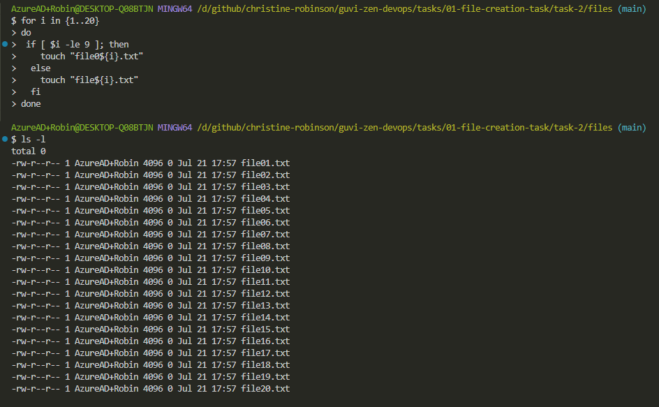
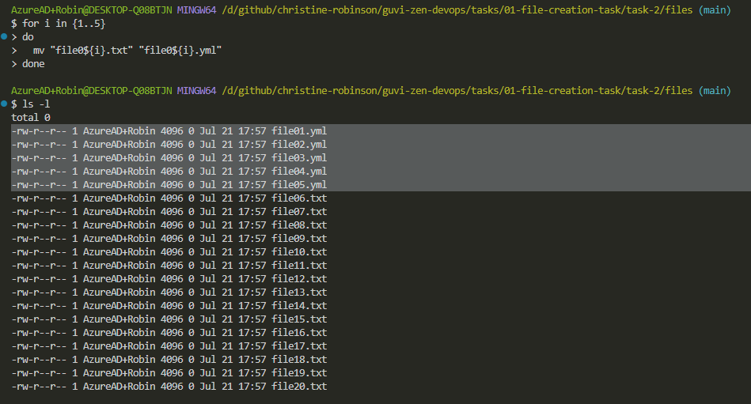
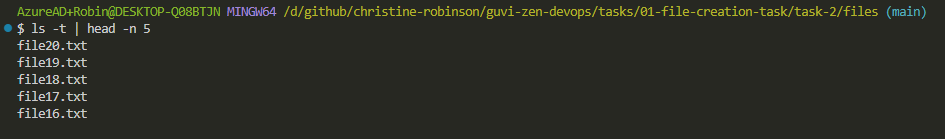

# Task 2

**Step 1:** Create 20 files with ".txt" extension

```bash
# Create a directory to hold the files
mkdir files
cd files

# Print the present working directory
pwd

# List files
ls -l

# Create 20 files with ".txt" extension
for i in {1..20}
do
 if [ $i -le 9 ]; then
    touch "file0${i}.txt"
  else
    touch "file${i}.txt"
  fi
done

# List files
ls -l
```





**Step 2:** Rename the first 5 ".txt" files to ".yml"

```bash
for i in {1..5}
do
  mv "file0${i}.txt" "file0${i}.yml"
done

# List files
ls -l
```



**Step 3:** List and print the latest 5 created files

```bash
ls -t | head -n 5
```


