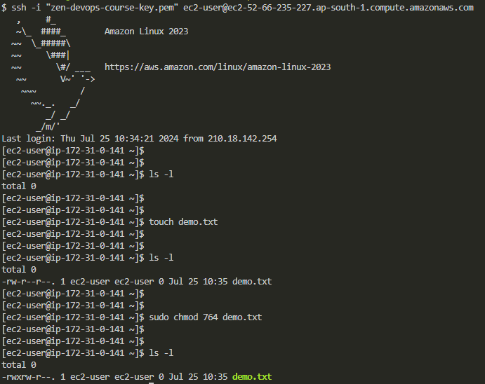

# 2. File Permission Task - I

**Step 1:** Create a file with .txt extension.

```bash
touch demo.txt
```

**Step 2:** Change the permission set of that file, so that any user can **read** it, group can **read/write** & owner can **read/write/execute** it.

```bash
sudo chmod 764 demo.txt
```


