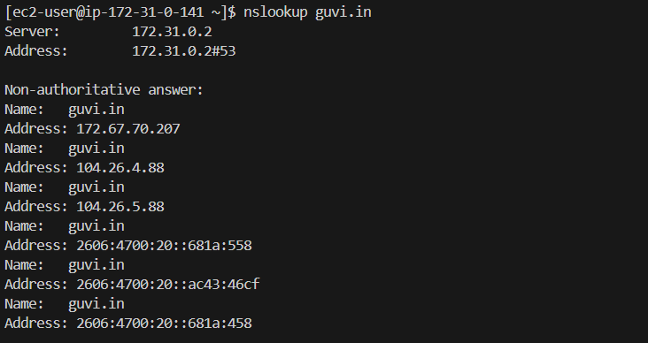
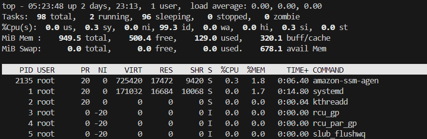
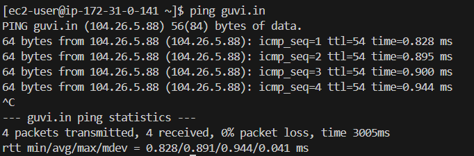

# 3. Network Task - I

Get me the IP address of a particular domain (guvi.in). How do I find my **CPU/Memory** usage of my server?. Test the connectivity between 2 nodes?

**Step 1:** Get me the IP address of a particular domain (guvi.in)

```bash
nslookup guvi.in
```



**Step 2:** How do I find my **CPU/Memory** usage of my server?

```bash
top
```



**Step 3:** Test the connectivity between 2 nodes

```bash
ping guvi.in
```


