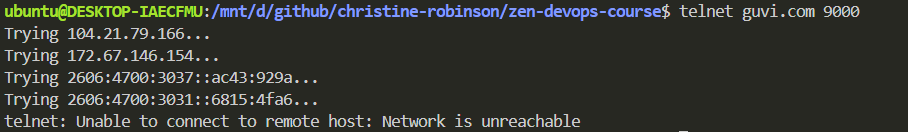

# 3. Network Task - II

I have deployed an application in **guvi.com:9000**. Check whether port **9000** is open or not.

```bash
curl guvi.com:9000
```



**Conclusion:**

* My internet connection is stable.
* Most probably port 9000 is not opened.
