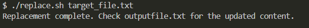

# 4. Scripting Task - II

Given a file, replace all occurrence of the word "give" with "learning" from 5th line till the end in only those lines that contain the word "welcome".

***replace.sh***

```bash
#!/bin/bash

input_file=$1
output_file="output_file.txt"

# Check if the file exists
if [ ! -f "$input_file" ]; then
  echo "Error: File '$input_file' not found."
  exit 1
fi

# Check if the file is empty
if [ ! -s "$input_file" ]; then
  echo "Error: File '$input_file' is empty."
  exit 1
fi

# Use awk to process the file
awk 'NR<5 { print; next }
     /welcome/ { gsub(/give/, "learning") }
     { print }' "$input_file" > "$output_file"
     
echo "Replacement complete. Check $output_file for the updated content."
```

***target_file.txt***

```text
1. Hello, welcome you give this a try.
2. You are welcome here.
3. Give it a shot.
4. Welcome to the world of learning.
5. This is where we give and take.
6. We welcome new ideas and give feedback.
7. Let's give it another go.
8. A warm welcome to all.
```



***output_file.txt***

```text
1. Hello, welcome you give this a try.
2. You are welcome here.
3. Give it a shot.
4. Welcome to the world of learning.
5. This is where we give and take.
6. We welcome new ideas and **learning** feedback.
7. Let's give it another go.
8. A warm welcome to all.
```
